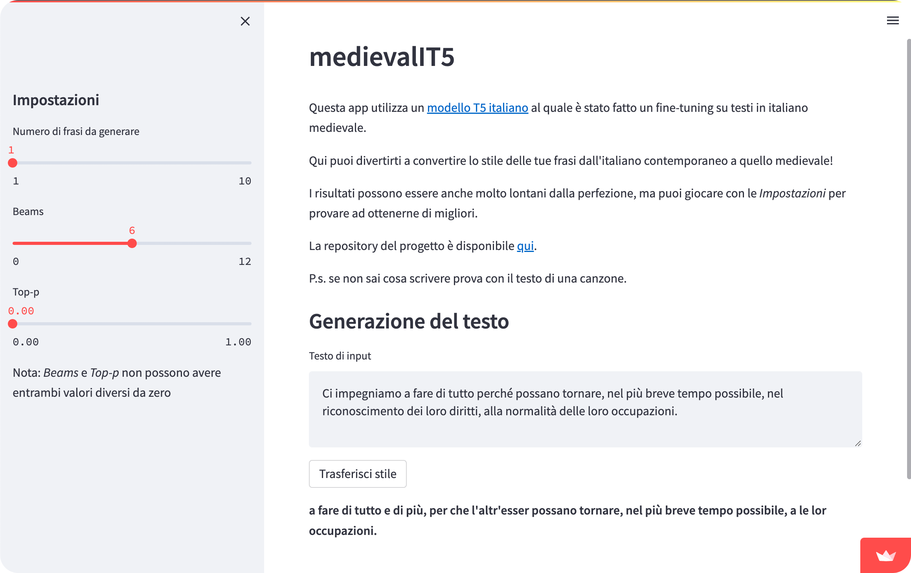

# medievalIT5 - Text Style Transfer from contemporary to medieval italian

Text Style Transfer (TST) is a task in which the *source style* of a text is changed to a chosen *target style*. The task aims to change the style of a given sentence while preserving its semantics.

Here I show how to fine-tune an [italian T5 model](https://huggingface.co/gsarti/it5-small) to perform TST from contemporary to medieval italian using a custom dataset called **ita2medieval**.

The fine-tuned model can be tested using an [online app](https://leobertolazzi-danteit5-app-cloud-ita-c2olq1.streamlit.app/) made with [Streamlit](https://streamlit.io/) (the app is in italian).

The app looks like this:



To obtain better results, it is suggested to experiment with "Impostazioni". For simplicity, the only generation methods which can be used are *Beam search* and *Nucleus sampling*.

## Dataset
The **ita2medieval** dataset contains sentences from medieval italian along with paraphrases in contemporary italian (approximately 6.5k pairs in total). The data is scraped from [letteritaliana.weebly.com](https://letteritaliana.weebly.com/) and the texts are by Dante, Petrarca, Guinizelli and Cavalcanti. 

Here are the first three rows of the ita2medieval dataset:

italian | medieval
------------- | -------------
Se l'ira si aggiunge alla malvagità, essi ci verranno dietro più crudeli del cane contro la lepre che vuole azzannare | Se l’ira sovra ’l mal voler s’aggueffa, ei ne verranno dietro più crudeli che ’l cane a quella lievre ch’elli acceffa’
E nel mio petto non si era ancora estinto l'ardore del sacrificio, quando mi accorsi che quella preghiera era stata bene accetta | E non er’anco del mio petto essausto l’ardor del sacrificio, ch’io conobbi esso litare stato accetto e fausto
Sotto ogni faccia uscivano due grandi ali, proporzionate a un essere tanto grande: non ho mai visto vele di navi così estese | Sotto ciascuna uscivan due grand’ali, quanto si convenia a tanto uccello: vele di mar non vid’io mai cotali

## Installation
The code was developed using Python 3.8. To install the dependencies, run the following at the repo root:
```
$ python -m venv venv
$ source venv/bin/activate
$ pip install -r requirements.txt
```

## Run the fine-tuning
After installing the dependencies, to fine-tune IT5 on ita2medieval, run:
```
$ python fine_tuning.py
```
An new folder called `model` will be created with the best model checkpoint in it.

## Run the app locally
After the fine-tuning, if you want to test the model through the app, run:
```
$ streamlit run app_local.py
```

## Cloud app
If you only want to try the model without fine-tuning it from scratch, you can browse to the cloud app [here (ita)](https://leobertolazzi-danteit5-app-cloud-ita-c2olq1.streamlit.app/). The cloud app uses the already fine-tuned model on the [Hugging Face Hub](https://huggingface.co/leobertolazzi/medieval-it5-small).

## Limitations
The biggest limitation for this project is the size of the ita2dante dataset. In fact, it consists only of 6K sentences whereas [gsarti/it5-small](https://huggingface.co/gsarti/it5-small) has more than 70M parameters.

It would be nice to expand ita2medieval with text and paraphrases from more medieval italian authors!
